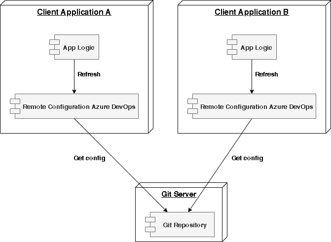

# Remote configuration Library 

Remote Configuration is Nodejs library approach for serving distributed configurations across multiple applications and environments.

This configuration store is ideally versioned under Git version control and can be modified at application runtime. While it fits very well in NodeJS applications using the supported configuration json file formats.



As you can see, the remote configuration lives in its own application. All this application does is request information to Git repositories, from client applications asking for configuration, and return the applicable configuration for those requests.

## Requirements

- Repository in azure devops
- Json file with configuration

The file must be versioned in the default branch of the repository. 

### Example : json file

config.json
```
{
    "Test": "test value",
    "List": [
        "Test 1", 
        "Test 2"
    ],
    "flag": true
}
```

## Installation

npm 

```
npm i azure-devops-remote-config --save
```

## Dependencies

the project depends on the azure devops node api library to query the azure api.

[azure-devops-node-api](https://www.npmjs.com/package/azure-devops-node-api)


## Setup and use

add a property to the class
```
import * as common from 'azure-devops-task-utils';

//dependencies
import * as AzureDevOpsApi from 'azure-devops-node-api';


import * as RemoteConfiguration from 'azure-devops-remote-config';
import * as IRemoteConfig from 'azure-devops-remote-config/interfaces/RemoteConfig';


```
in the appropriate place refer to the configuration information
```

    const project: string = 'project id';
    const repository: string = 'repository name';
    const path: string = 'config.json';
    const webapi: AzureDevOpsApi.WebApi = await common.getWebApi();
    const configRemote: IRemoteConfig.RemoteConfigApi = await RemoteConfiguration.getRemoteConfigApi(
        webapi,
        project,
        repository,
        path,
    );

    const value :string = configRemote.getValueConfiguration<string>('Test');
    console.log(`value : ${value}`)

```

## Summary

Read a config file from your git repository. It is a json file with configuration, flags, etc.


